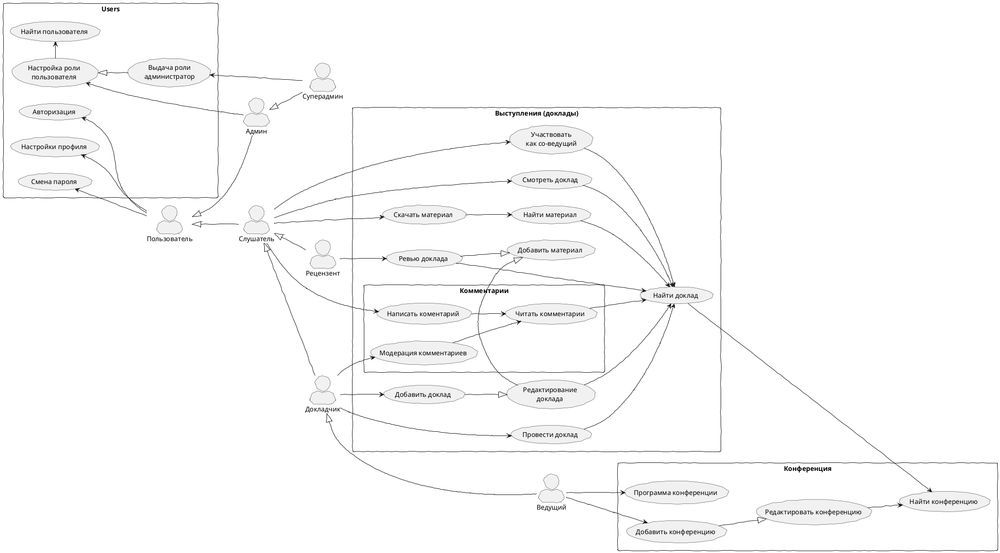

# Описание требований и архитектуры

## Введение
<!-- Общее краткое описание создаваемой системы -->
В рамках курса осуществляется проектирование решения на основе [постановки задачи от "заказчика"](../../task.md).

- [Описание требований и архитектуры](#описание-требований-и-архитектуры)
  - [Введение](#введение)
  - [Заинтересованные стороны](#заинтересованные-стороны)
  - [Бизнес-контекст (бизнес-требования)](#бизнес-контекст-бизнес-требования)
  - [Глоссарий](#глоссарий)
  - [Модель предметной области](#модель-предметной-области)
  - [Требования к системе](#требования-к-системе)
    - [Сценарии использования (Use case)](#сценарии-использования-use-case)
    - [Функциональные требования](#функциональные-требования)
    - [Нефункциональные требования/Требования к атрибутам качества](#нефункциональные-требованиятребования-к-атрибутам-качества)
    - [Ограничения](#ограничения)
  - [Архитектура](#архитектура)
    - [Журнал архитектурных решений](#журнал-архитектурных-решений)
    - [Контекст решения](#контекст-решения)
    - [Компонентная архитектура](#компонентная-архитектура)
    - [Реализация сценариев использования](#реализация-сценариев-использования)
    - [Программные интерфейсы](#программные-интерфейсы)
    - [Схема развертывания](#схема-развертывания)
  
## Заинтересованные стороны
<!-- Перечень заинтересованных сторон и их интересов по отношению к создаваемой системе. 
Подробнее: https://confluence.mts.ru/pages/viewpage.action?pageId=399975538 
-->
| Заинтересованная сторона | Интересы           |
|:-------------------------|:-------------------|
| Спонсоры               | Инструмент для продвижения своих продуктов и услуг |
| Заказчики               | Создание платформы организации и проведения конференций с эффективным управлением докладами, расписанием и комментариями |
| Ведущие helloconf | Организация и проведение конференции helloconf |
| Докладчики               | Информировать и заинтересовать аудиторию, а также получить обратную связь и мнения других участников конференции |
| Слушатели               | Ознакомление с материалами докладов конференции и участие в их обсуждении |
| Пользователи | Система должна быть защищена от взломов, хакерских атак и утечки личных данных |
| Команда разработки | Создание высококачественной системы онлайн-конференций, удовлетворяющей потребности заказчика и пользователей, с использованием современных технологий |
| Правообладатель | Соблюдение авторских прав в материалах размещаемых или используемых на конференциях |

## Бизнес-контекст (бизнес-требования)
<!-- Общее описание бизнес-контекста создаваемой системы (автоматизируемой деятельности), список бизнес-целей заинтересованных сторон 
Подробнее: https://confluence.mts.ru/pages/viewpage.action?pageId=399973845
-->
Необходим инструмент организации и проведения конференций в режиме онлайн, где обеспечить поддержку большого числа участников. Стартовым проектом является проведение конференции helloconf. Ведущий конференции должен иметь возможность рецензировать доклады, давать обратную связь и составлять программу конференции. Докладчикам необходимо обеспечить возможность проведения выступлений как в одиночку так и совместно, а также добавлять дополнительные материалы.Слушателям необходимо предоставить возможность просмотра выступлений онлайн, старых записей, скачивания дополнительных материалов, а также комментирования выступлений.

## Глоссарий
<!-- Содержит основные понятия и термины предметной области  
Подробнее: https://confluence.mts.ru/pages/viewpage.action?pageId=375782595
-->
| Понятие                        | Сокращение/синоним               | Определение                       |
|:-------------------------------|:-----------------------------------|:----------------------------------|
| Конференция |  | Мероприятие, на котором участники собираются для обсуждения конкретной темы или тематики с целью обмена опытом, знаниями и мнениями между участниками |
| Выступление | Доклад | Составная часть конференции представляющая собой онлайн-трансляцию перед аудиторией на тему, связанную с тематикой конференции. Выступление проводится онлайн и может быть организовано в форме доклада, презентации или совместной дискуссии |
| Система |  | Разрабатываемый продукт, реализующий организацию, планирование и проведений конференций |
| Участник |  | Пользователь системы, который принимает участие в мероприятии и обсуждает тему или тематику, на которую оно посвящено. Участниками могут быть как ведущие выступления на конференции, так и слушатели, которые просто присутствуют на выступлениях и могут взаимодействовать с другими Участниками через комментарии |
| Слушатель |  | Участник конференции, который присутствует на выступлении, может скачивать дополнительные материалы к выступлению и может взаимодействовать с другими Участниками через комментарии |
| Докладчик |  | Участник конфереции, который проводит онлайн-выступление с целью поделиться своими знаниями, опытом, исследованиями или мнением на тему, связанную с тематикой конференции |
| Ведущий | Модератор | Участник и организатор конференции, представляет докладчика или группу докладчиков на выступлениях и вводит их в аудиторию. Может проводить вводную часть выступления, объяснять цель мероприятия и рассказывать о теме, которая будет обсуждаться, может задавать вопросы докладчикам и модерировать дискуссию между участниками |
| Рецензент |  | Пользователь системы осуществляющий контроль материалов выступлений на нарушение авторских прав |
| Рецензия |  | Разрешение или отказ к выступлению, которое может создать рецензент, может дополняться комментарием. Отказывающая рецензия обязывает докладчика исправить указанные замечания для возможности проведения выступления |
| Дополнительные материалы | Вложения | Файлы, которые докладчик может приложить к своему выступлению |
| Трансляция | Стрим | Аудио- или видео- медиапоток онлайн выступление одного или нескольких докладчиков выступления. Может заменяться заранее подготовленным файлом, размещаемым докладчиком при подготовке выступления. Совместные онлайн-выступления докладчиков складываются из нескольких входных потоков видеокамер в единый выходной поток доступный участникам выступления |
| Комментарий |  | Текстовое сообщение, которое может оставить любой участник конференции к выступлению |

## [Модель предметной области](data/data.md)

## Требования к системе

### Сценарии использования (Use case)
<!-- Подробное описание сценариев использования системы с привязкой к ролям участников и задействованным бизнес-сущностям 
https://confluence.mts.ru/pages/viewpage.action?pageId=375782108 
https://confluence.mts.ru/pages/viewpage.action?pageId=375782119 
-->
#### Диаграмма сценариев использования (Use Case Diagram) <!-- omit in toc -->

#### Список сценариев использования <!-- omit in toc -->

| ID     | Описание                                          |
|--------|---------------------------------------------------|
| UC.001 | *[Провести доклад](uc/uc.001.md)* |
| UC.002 | *[Редактирование доклада](uc/uc.001.md)* |
| UC.003 | *[Найти доклад](uc/uc.001.md)* |
| UC.004 | *[Участвовать как со-ведущий](uc/uc.001.md)* |
| UC.005 | *[Смотреть доклад](uc/uc.001.md)* |
| UC.006 | *[Добавить доклад](uc/uc.001.md)* |
| UC.007 | *[Добавить материал](uc/uc.001.md)* |
| UC.008 | *[Добавить конференцию](uc/uc.001.md)* |
| UC.009 | *[Редактировать конференцию](uc/uc.001.md)* |
| UC.010 | *[Найти конференцию](uc/uc.001.md)* |
| UC.011 | *[Программа конференции](uc/uc.001.md)* |
| UC.012 | *[Скачать материал](uc/uc.001.md)* |
| UC.013 | *[Найти материал](uc/uc.001.md)* |
| UC.014 | *[Написать коментарий](uc/uc.001.md)* |
| UC.015 | *[Читать комментарии](uc/uc.001.md)* |
| UC.016 | *[Модерация комментария](uc/uc.001.md)* |
| UC.017 | *[Ревью доклада](uc/uc.001.md)* |

### Функциональные требования
<!-- Описание требований к функциям, реализуемым системой. Требование может быть привязано к сценарию использования или быть общим 
Подробнее: https://confluence.mts.ru/pages/viewpage.action?pageId=375782501 
-->
| ID     | Функциональное требование             |
|--------|---------------------------------------|
| FR.001 | Пользователь должен иметь возможность войти в систему, используя свое имя пользователя и пароль |
| FR.002 | Пользователь должен иметь возможность зарегистрироваться в системе для получения доступа указав своё имя, email и пароль |
| FR.003 | Пользователь не должен иметь доступ к докладам и материалам конференций без авторизации |
| FR.004 | Модули системы не должны иметь доступ к чувствительным данным пользователя (email, пароль) |
| FR.005 | Пароль пользователя должен храниться в хэшированном виде |
| FR.006 | Пользователь не должен иметь доступ к докладам и материалам, которые ещё не начались, или которые не были одобрены рецензентом |
| FR.007 | Система должна реализовывать ролевую систему доступа пользователей, где: *слушатель* - любой авторизованный пользователь с возможностью просмотра докладов, скачивания материалов, чтения и добавления комментариев, *докладчик* - пользователь с этой ролью может создавать выступления и редактировать их,добавлять материалы и назначать со-докладчиков к своим выступлениям, *со-докладчик* - дополнительный ведущий доклада без возможности редактирования выступления, *ведущий* - пользователь, который может создавать, настраивать, планировать и управлять конференцией, *рецензент* - пользователь, который может проводить ревью материалов выступлений до момента их начала, *администратор* - пользователь с возможностью назначения ролей пользователям, *суперадминистратор* - администратор с возможностью назначения роли администратор |
| FR.008 | Система должна позволять пользователям создавать конференции и управлять ими, добавлять ведущих и составлять расписание выступлений |
| FR.009 | Система должна позволять пользователям создавать выступления и управлять ими, добавлять со-ведущих, размещать дополнительные материалы (файлы) |
| FR.010 | Система должна позволять ведущим проводить онлайн конференции с одним ведущим или несколькими |
| FR.011 | Система должна позволять ведущим вести доклады в виде видеотрансляции (стрим), записанного заранее видео, аудиотрансляции (стрим) и записанного заранее подкаста |
| FR.012 | Система должна сохранять видео/аудио выступлений в режиме стрима, конвертируя поток в кодек h264 |
| FR.013 | Выходной поток видео- и аудио- выступлений (стримов) должен объединяться в один общий, для видеопотоков результатом должно быть видео с представлнием ведущих в виде сетки |
| FR.014 | Система должна предоставлять доступ к конференциям с портала (сайта) и специального мобильного приложения |
| FR.015 | Докладчик имеет возможность загрузить дополнительные материалы (файлы) размером до 10 МБ, допустимые типы файлов: pdf, png, jpeg, ppt, ppx, odt |
| FR.016 | Система реализует систему мониторинга активности участников конференции с аналитиков для ведущих (по отдельной конференции), докладчиков (по отдельному докладу), а также сквозную аналитику для администраторов системы (по всем конференциям) |
| FR.017 | Канал взаимодействия между пользовательским интерфейсом и системой должно быть защищен шифрованием |

### Нефункциональные требования/Требования к атрибутам качества
<!-- Требования к основным архитектурным характеристикам (атрибутам качества) системы - надежность, масштабируемость, ИБ, и др.
Подробнее: https://confluence.mts.ru/pages/viewpage.action?pageId=375782530
-->
| ID     | Атрибут качества             | Описание требования                       |
|--------|------------------------------|-------------------------------------------|
| QR.001 | Система должна обеспечивать возможность одновременного проведения 10 выступлений с поддержкой видеотрансляции (стримы) | Время ответа на запрос клиентского приложения за следующей частью видеопотока, при количестве одновременно активных видеовыступлений до 10 (с качеством выходного потока 1920x1080), не превышает время воспроизведения ранее загруженной части (отсутствие задержек воспроизведения) |
| QR.002 | Система должна обеспечивать возможность участия в каждом выступлении не менее 1000 человек (до 10 из которых могут быть выступающими) | QR.001 выполняется для всех участников каждого из одновременных выступлений при числе участников выступлений до 1000 человек или общего числа в 10000 участников |
| QR.003 | Система должна обеспечивать возможность проведения выступлений длинной до 8 часов | Видеотрансляции успешно проводятся с максимальной длительностью до 8 часов, конвертированный видеофайл с записью выступления равен по времени времени трансляции |
| QR.004 | Реакция системы на действие пользователя не должна превышать 5 сек | Время от запроса с пользовательского приложения до момента вывода информации пользователю не превышает 5сек |
| QR.005 | Система должна предоставлять пользователю возможность выбора качества видео-потока для оптимизации доступа через слабый канал | Пользователь может выбрать желаемое качество видеопотока: 640x480, 1280x720, 1920x1080, QHD |
| QR.006 | Система поддерживать ежегодный рост на 15% количества участников конференции онлайн |  |
| QR.007 | SLA | Доступность системы 99,99% |
| QR.008 | SLA | RPO 24h |
| QR.009 | SLA | RTO 1h |
| QR.010 | SLA | Доступность APP/WEB-страниц: 99% |
| QR.011 | SLA | Стабильность по скорости открытия APP/WEB-страниц: 99% |

### Ограничения
<!-- Описываются ограничения, оказывающие влияние на архитектуру системы - временные, финансовые, технологические
Подробнее: https://confluence.mts.ru/pages/viewpage.action?pageId=375782592
-->
| ID     | Ограничение            |
|--------|------------------------|
<!-- | AC.001 | Требования по нагрузке актуальны для стартовой версии, в дальнейшем возможно увеличение | -->

## Архитектура

### Журнал архитектурных решений
<!-- Записи о ключевых принятых архитектурных решениях (ADR) для реализации архитектурно-значимых требований.
Подробнее: https://confluence.mts.ru/pages/viewpage.action?pageId=421162308
-->
- [ADR.NNN Суть решения](adr/adr-template.md)

### [Контекст решения](context/context.md)

### [Компонентная архитектура](components/components.md)

### Реализация сценариев использования
<!-- Реализация сценариев использования на основе взаимодействия компонентов системы и внешних систем/участников.
Диаграммы последовательности (UML Sequence diagram) и текстовое описание.

Подробнее: 
https://confluence.mts.ru/pages/viewpage.action?pageId=399442132
https://confluence.mts.ru/pages/viewpage.action?pageId=399442170
-->
| ID     | Описание                          | Реализация                                    |
|--------|-----------------------------------|-----------------------------------------------|
| UC.001 | *Название сценария использования* | [Реализация сценария](uc-impl/uc.001-impl.md) |

### Программные интерфейсы
<!-- Спецификации публичных API системы и ее компонентов (синхронных, событийных). Создается на основе модели предметной области для реализации сценариев использования. 
  Форматы: OAS/Swagger, GraphQL, AsyncAPI/CloudEvents
-->
| Компонент             | Интерфейс                                      |
|:----------------------|:-----------------------------------------------|
| *Название компонента* | *[Название интерфейса](api/service-name.yaml)* |

### [Схема развертывания](deployment/deployment.md)
