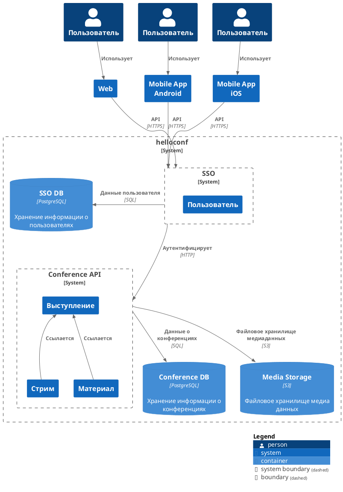

# Компонентная архитектура
<!-- Состав и взаимосвязи компонентов системы между собой и внешними системами с указанием протоколов, ключевые технологии, используемые для реализации компонентов.
Диаграмма контейнеров C4 и текстовое описание. 
Подробнее: https://confluence.mts.ru/pages/viewpage.action?pageId=375783368
-->
## Контейнерная диаграмма

## Список компонентов
| Компонент             | Роль/назначение                  |
|:----------------------|:---------------------------------|
| SSO | Авторизация и регистрация пользователей, аутентификация запросов к API |
| Conference API | Сервис реализующий API работы с конференциями |
| Media Storage | Файловое хранилище медиаданных (записи видео/аудио, дополнительные материалы к встречам) |
