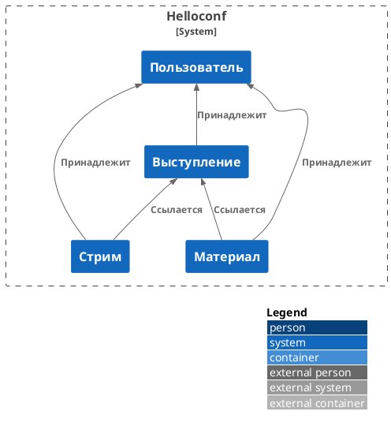

# Диаграмма контекстов

```plantuml
@startuml
'!include https://raw.githubusercontent.com/plantuml-stdlib/C4-PlantUML/master/C4_Container.puml
!include <C4/C4_Container>

LAYOUT_WITH_LEGEND()

System_Boundary(helloconf, "Helloconf") {
    System(user_agg, "Пользователь", "")
    System(conf_agg, "Выступление", "")
    System(stream_agg, "Стрим", "")
    System(attach_agg, "Материал", "")
}

Rel_U(attach_agg, conf_agg, "Ссылается")
Rel_U(stream_agg, conf_agg, "Ссылается")
Rel_U(conf_agg, user_agg, "Принадлежит")
Rel_U(attach_agg, user_agg, "Принадлежит")
Rel_U(stream_agg, user_agg, "Принадлежит")

@enduml
```
